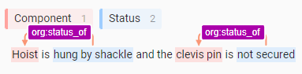

This document aims to present Relation Entity Extraction in NLP and how to do it. All data used for the training and testing has been removed so you might not be able to reproduce it.

# Introduction

Relation Entity Extraction is the process of identifying the relation between entities in a given text. There is several way of doing that. Some techniques leverage position and dependency tagging or pretrained models, others require to train customs models.

In the exemple below, we can see potentials relation (in purple) between component and status.



In this page, we will focus on the training method as it is a bit more complex to use.

As we can see in the image above, doing a custom trainable relation extraction component requires to train two models:

- One for Named Entity Recognition (NER). In our example, the idea will be to detect in the text the Component and Status entities. I also tried Spacy SpanCat but I was not happy with the results.
- Once you are able to detect the entities you are interested in, you need to find whether there is the relation you are looking for between them. The idea to achieve this is to build a classifier that takes the embedding of the entities extracted and determine if yes or no, they have a relation. The explained process can be find here.

# How to do with Spacy

The first step to achieve Relation Entity Extraction is to get labeled data. Unfortunately this step is quite time consuming as it requires to label the entity you want to recognize and the relation between them. A free tool that can be handy for that is Label Studio.

1. For NER it is better to produce a IOB or CoNLL file. They correspond to the classic format to train NER.
2. For relation extraction, the best is to produce a JSON or JSONL.

## NER

Once labeling done, it is quite easy to train a model that leverage Transformers with Spacy. Of course, you can also do it using Transformers library if you want but it might requires a bit more of coding for a very similar result.

1. Convert your data files to the Spacy format. See documentation here. Usually, it just consist in using the following command:
```
$ python -m spacy convert ./input_file.conll ./outptut_folder --lang en -t spacy"
```
2. Generate a config file. See documentation here. You can also use this predefined config file config_spacy.cfg. It leverages a distilroberta-base. You can replace it by any model from the HuggingFace hub that would suit more your need. It is also in the config file that you will input your training parameters. Don't hesitate to tune them for your needs.
3. Train your model using train CLI using.  You  can  also  use  the  tag  --gpu-id 0 to  use  GPU if cuda setup on your computer. Train documentation can be found here.
```
$ python -m spacy train config_spacy.cfg --output ./output_dir --paths.train ./train_data.spacy --paths.dev ./dev_data.spacy
```

## Relation Entity

The relation entity is a bit more complex but spacy still provides some tool to help us in that task. However, it is not included by default in their library and you will need to clone one of their sample project to use as a starting point.

1. Clone the relation entity project from spacy repo:
```
$ python -m spacy project clone tutorials/rel_component
```
2. Next step will be to convert the data files to the Spacy format. However, this time it won't be possible to use the Spacy convert.
    - Either you try to use the schema used by Spacy in their examples here. Then you can use the script in ./rel_component/scripts/parse_data.py to convert it.
    - The other solution is to adapt the  ./rel_component/scripts/parse_data.py so it can directly work on your data format.
3. You can now train your model. If needed, you can modify the config.cfg provided by Spacy. Personally, I like to switch the model from roberta-base to distilroberta-base as it offers faster training without loosing too much accuracy.
    ```
    $ python -m spacy project run train_gpu
    ```
    or
    ```
    $ python -m spacy project run train_cpu
    ```

# Using pretrained models

Pretrained models also exist to do Relation Extraction. They can be quite useful depending on your needs but might not focus on the entities you are targeting and might not provide the relations you want.

One of the SotA model for Relation Extraction is REBEL: Relation Extraction By End-to-end Language generation.

It is very easy to use and quite powerful as you will see on their GitHub page. Before starting training your own pipeline, I would suggest to test this one first as it might solve your use case.

# References
- Rebel pretrained model: https://github.com/Babelscape/rebel
- Relation Extraction using dependency's tagging: https://hami-asmai.medium.com/relationship-extraction-from-any-web-articles-using-spacy-and-jupyter-notebook-in-6-steps-4444ee68763f
- Train a customer NER with Spacy: https://towardsdatascience.com/how-to-fine-tune-bert-transformer-with-spacy-3-6a90bfe57647
- Train a relation extraction entity with Spacy: https://towardsdatascience.com/how-to-train-a-joint-entities-and-relation-extraction-classifier-using-bert-transformer-with-spacy-49eb08d91b5c
- Spacy video on how to setup a relation extraction entity from scratch.
- Spacy documentation: https://spacy.io/usage
- Spacy training quickstart: https://spacy.io/usage/training#quickstart
- Spacy relation extraction project: https://github.com/explosion/projects/tree/v3/tutorials/rel_component
